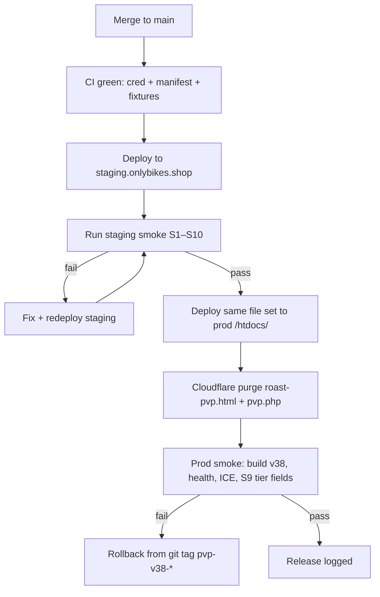

# Live PvP — Staging Environment (`staging.onlybikes.shop`)

Staging mirrors production PvP stack (**v38 cascade vision**, cred scoring, NPC grading, WebRTC) without touching live riders or prod DB rows.

**Production:** `https://onlybikes.shop` → IONOS `/htdocs/`  
**Staging:** `https://staging.onlybikes.shop` → IONOS `/htdocs-staging/`

**Cascade stack (v38):** Tier 0 instant seed → Tier 1 fast OR-Qwen (1–2 s, no Groq) → Tier 2 full Agents 1+2+3 via `cron-tier2.php`.

---

## 1. IONOS setup (one-time)

| Step | Action |
|------|--------|
| 1.1 | Create sibling folder `/htdocs-staging/` on the same IONOS contract (or a separate Level-2 package if you want full isolation). |
| 1.2 | Copy site tree from prod: `api/`, `images/`, `js/`, `includes/`, `roast-pvp.html`, `roast-credits-ui.js`, `models/`, `llama-b9285/`, `.htaccess`. |
| 1.3 | Create **staging** `api/.env` (never commit). Start from `api/.env.example`; apply overrides in §3. |
| 1.4 | Point subdomain DNS (§2). |
| 1.5 | chmod `755` on `llama-b9285/llama-cli`; confirm `api/cache/roast-tmp/` writable. |
| 1.6 | Register `cron-tier2.php` in IONOS WebCron (§3) — same `CRON_SECRET` as health smoke. |

FileZilla: same workflow as `FILEZILLA-ROAST-UPLOAD.txt`, but remote root is `/htdocs-staging/`.

---

## 2. Cloudflare DNS + cache

| Record | Type | Value | Proxy |
|--------|------|-------|-------|
| `staging` | CNAME or A | Same origin IP / host as `onlybikes.shop` | Proxied (orange cloud) |

**Page rules / cache:**

- Purge `staging.onlybikes.shop/roast-pvp.html` after every staging deploy.
- Optional: Cache Level = Bypass for `/api/roast-limited/pvp.php` on staging to avoid stale ICE/TURN during TURN key changes.

**Turnstile (optional):** Add `staging.onlybikes.shop` as an allowed hostname on the existing Turnstile widget, or create a staging-only widget.

---

## 3. Staging `api/.env` overrides

Copy production secrets where shared infra is acceptable; **override** these for staging isolation:

```env
# Origin — required for CORS, mail links, OpenRouter referer
SITE_ORIGIN=https://staging.onlybikes.shop

# Event — always on in staging for QA
ROAST_EVENT_ENABLED=1
ROAST_EVENT_END=2026-12-31

# Cascade vision — Tier 1 must NOT burn Groq (25/day cap reserved for Tier 2 cron)
ROAST_VISION_SKIP_GROQ=1
ROAST_OPENROUTER_API_KEY=<required-for-tier1>
ROAST_GROQ_API_KEY=<required-for-tier2-cron>
ROAST_GROQ_DAILY_MAX=25
ROAST_PIPELINE_MODE=cloud_first
ROAST_VISION_TIMEOUT_SEC=12
ROAST_PVP_T1_TIMEOUT_SEC=3

# Optional Tier 1 sidecar (free fast path before OR-Qwen)
# ROAST_VISION_VPS_URL=https://vision-sidecar.example.com/identify
# ROAST_VISION_VPS_SECRET=<shared-secret>

# Lower caps — protect Groq/OR budget during QA
ROAST_RATE_LIMIT_PER_IP_PER_DAY=10
ROAST_DAILY_MAX_JOBS=30
ROAST_MAX_CONCURRENT=2

# QA bypass — lets testers skip daily roast limits (server-only secret)
ROAST_BYPASS_KEY=<generate-staging-only-key>

# NPC — same timing as prod for realistic queue tests
ROAST_PVP_NPC_ENABLED=1
ROAST_PVP_NPC_FALLBACK_SEC=10
ROAST_PVP_NPC_GRADE_DELAY_SEC=11

# WebRTC — separate Metered app recommended
PVP_TURN_APP=onlybikes-staging
PVP_TURN_SECRET_KEY=<staging-metered-secret>
# Or static credentials from Metered dashboard:
# PVP_TURN_USERNAME=
# PVP_TURN_CREDENTIAL=
# PVP_TURN_URLS=stun:stun.relay.metered.ca:80,turn:standard.relay.metered.ca:443

# Judge — same GGUF path under /htdocs-staging/
ROAST_JUDGE_GGUF=/homepages/.../htdocs-staging/models/qwen2.5-1.5b-instruct-q4_k_m.gguf
ROAST_MODELS_DIR=/homepages/.../htdocs-staging/models
ROAST_TMP_DIR=/homepages/.../htdocs-staging/api/cache/roast-tmp

# Database — MUST NOT write to prod PvP tables
# Option A: dedicated staging DB (recommended)
ROAST_DB_HOST=<staging-host>
ROAST_DB_NAME=dbs_staging_roast
ROAST_DB_USER=<staging-user>
ROAST_DB_PASS=<staging-pass>
CUSTOMERS_DB_HOST=<staging-or-shared-readonly>
# Option B: same CUSTOMERS_DB for auth smoke only; isolate roast_pvp_* via separate ROAST_DB_*

# Runtime credits — staging economy (generous for QA)
RUNTIME_SIGNUP_PVP=5
RUNTIME_COST_PVP=0
RUNTIME_GUEST_PVP_UNLOCKS_PER_IP_DAY=3

# Ads — off or house-only on staging
ROAST_ADSENSE_REVIEW_MODE=1
ROAST_MONETAG_ENABLED=0
ROAST_AD_WATERFALL=house

# Metrics + cron
ROAST_PVP_METRICS_LOG=/homepages/.../htdocs-staging/api/logs/pvp-metrics.log
CRON_SECRET=<staging-cron-secret>
```

**Build stamp:** After first deploy, set `PVP_INLINE_BUILD = 'pvp-inline-v38-staging'` in `roast-pvp.html` on staging only so lobby/console never confuses staging with prod.

**IONOS WebCron — Tier 2 queue** (register in panel; paste URL from `api/IONOS-CRON-PASTE.txt`):

```text
*/1 * * * *  GET  https://staging.onlybikes.shop/api/roast-limited/cron-tier2.php?key=CRON_SECRET
```

Use `*/15` if Tier 2 latency budget allows; `*/1` recommended for cascade smoke S10.

---

## 4. Staging smoke tests — cascade S1–S10 (before promotion)

Run on **staging** after every upload. All must pass before promoting to prod.

| # | Test | URL / command | Pass |
|---|------|---------------|------|
| S1 | Build stamp | `https://staging.onlybikes.shop/roast-pvp.html?debug=1` | Footer shows `pvp-inline-v38-staging`; console `[Roast PvP] DEPLOY CHECK — build=pvp-inline-v38-staging` |
| S2 | Health | `GET /api/roast-limited/test-roast-health.php?key=CRON_SECRET` | `ok: true`, `openrouter_api_key_set: true`, `groq_api_key_set: true`, tmp writable |
| S3 | ICE / TURN | `GET /api/roast-limited/pvp.php?action=ice` | `turnConfigured: true`, not `stun_only` |
| S4 | Cred unit (SSH) | `php api/roast-limited/test-pvp-cred-scores.php` | `0 failed` |
| S5 | Manifest | `php api/roast-limited/validate-pvp-manifest.php` | exit 0 |
| S6 | Live frame (offline) | `php api/roast-limited/test-pvp-live-frame.php --fixtures` | `score_frame_ok: true` on golden set (see `api/fixtures/pvp-live/README.md`) |
| S7 | NPC queue | Join alone ≥12 s | NPC video + `opponent_npc: true`; opponent shows Tier 0 `starting_score` immediately |
| S8 | Cross-network | Phone LTE vs desktop Wi-Fi | Stranger video connects (TURN relay) |
| S9 | **2 s first score + tier fields** | Start NPC or human duel; DevTools → Network → `live_frame` + `status` poll | Within **3 s** of round start: response includes `score_tier >= 1`, `provisional: true`, `display_score` > 0; poll exposes `score_tier`, `score_source`, `vision_backend`, `vision_fallback`, `tier2_pending` / `tier2_ready` when applicable |
| S10 | **`ROAST_VISION_SKIP_GROQ` + cron-tier2** | Confirm staging `.env` has `ROAST_VISION_SKIP_GROQ=1`; run one duel ≥60 s; trigger cron manually: `GET /api/roast-limited/cron-tier2.php?key=CRON_SECRET` | Tier 1 `live_frame` responses show `vision_backend` **not** `groq_*`; `pvp-metrics.log` has no Groq consume on Tier 1 path; after cron: `tier2_ready: true`, `score_tier: 2`, `display_score` revised; cron JSON reports `processed >= 1` or `pending: 0` |

### S9 detail — tier field checklist

On first `live_frame` (sent ~2 s after duel start with `initial_frame=1`):

| Field | Expected (Tier 1) |
|-------|-------------------|
| `score_tier` | `1` (or `0` if cache/NPC seed only — must reach `1` by second frame) |
| `provisional` | `true` |
| `display_score` | Integer 54–98 (not stuck at hidden 54 floor when real vision lands) |
| `score_source` | `vision` or `cache` (not bare `fallback` on hero bike) |
| `vision_backend` | `openrouter_*` or `sidecar_*` — **never** `groq_*` when `ROAST_VISION_SKIP_GROQ=1` |
| `vision_fallback` | `false` on well-lit full bike |

On `status` poll after Tier 2 cron (S10):

| Field | Expected (Tier 2) |
|-------|-------------------|
| `score_tier` | `2` |
| `provisional` | `false` |
| `tier2_ready` | `true` |
| `tier2_pending` | `false` |

### S10 detail — Groq skip + cron

1. Verify `ROAST_VISION_SKIP_GROQ=1` in staging `api/.env` (interim until Tier 1/2 code split is fully deployed; keeps Groq budget for Tier 2 only).
2. Complete at least one duel long enough for `tier2_pending=1` on the match row.
3. Hit cron URL (or wait for WebCron interval).
4. Confirm `tier2_ready=1` on poll within one cron cycle + one status poll (~2 s).
5. Inspect `api/logs/pvp-metrics.log` for `tier2_latency_ms` and `groq_budget_remaining`.

Optional vision integration (uses API keys):

```bash
php api/roast-limited/test-pvp-opponent-images.php
# vision_fallback rate < 30% on opponent reference set
```

---

## 5. Promotion flow (staging → production)



### Promotion checklist

| Step | Owner | Detail |
|------|-------|--------|
| 1 | Dev | PR merged; `roast-pvp-ci.yml` green (`pvp-unit`, `pvp-manifest`, `pvp-smoke-offline`) |
| 2 | Platform | SFTP/FileZilla staging upload — file list from `FILEZILLA-ROAST-UPLOAD.txt` (PvP delta incl. `cron-tier2.php`) |
| 3 | QA | Staging smoke **S1–S10** (cascade gate) |
| 4 | Platform | Prod upload **same bytes** as staging (except `SITE_ORIGIN`, DB, TURN app, `ROAST_VISION_SKIP_GROQ` in `api/.env`) |
| 5 | Platform | Cloudflare purge prod `roast-pvp.html`, `/api/roast-limited/pvp.php`, `/images/pvp-opponents/*` if manifest changed |
| 6 | Platform | Register prod `cron-tier2.php` WebCron (`api/IONOS-CRON-PASTE.txt`) |
| 7 | QA | Prod verify: `pvp-inline-v38` (not `-staging`), health, ICE, S9 first score ≤3 s, one NPC round |
| 8 | Platform | Tag `pvp-v38-YYYY-MM-DD` in git for rollback |

**Never promote** if staging build stamp is still `pvp-inline-v38` copied from prod without the `-staging` suffix — that causes deploy confusion.

**Prod env note:** After cascade is validated on staging, prod may set `ROAST_VISION_SKIP_GROQ=1` permanently (Tier 1 OR-only; Groq reserved for `cron-tier2.php`).

### Rollback

1. Re-upload last good tag files to `/htdocs/`.
2. Purge Cloudflare.
3. Re-run prod smoke (health + cred unit + ICE + S9 tier fields).
4. If cred regression: confirm `api/lib/roast-score.php` version matches tag.
5. Disable or revert prod `cron-tier2.php` WebCron if Tier 2 queue causes score drift.

---

## 6. CI ↔ staging relationship

| Tier | Runs on | Keys | Blocks merge |
|------|---------|------|--------------|
| `pvp-unit` | GitHub Actions every PR | No | Yes — cred regression |
| `pvp-manifest` | GitHub Actions every PR | No | Yes — broken assets |
| `pvp-smoke-offline` | GitHub Actions every PR | No | Yes — golden fixtures (`api/fixtures/pvp-live/`) |
| `pvp-vision-integration` | `main` / nightly | Groq + OpenRouter | No (alert only) |
| Staging smoke **S1–S10** | Manual post-deploy | Server `.env` + `ROAST_VISION_SKIP_GROQ` | **Promotion gate** |

CI catches logic regressions before code reaches staging; staging catches TURN, DB, WebRTC, **2 s first score**, **tier fields**, and **cron-tier2** issues CI cannot simulate.

---

## 7. Related docs

- `FILEZILLA-ROAST-UPLOAD.txt` — prod/staging file manifest (sync to v38)
- `ROAST-PVP-UPLOAD.txt` — PvP-specific upload + ICE verification
- `api/ROAST-DEPLOY.md` — vision/judge pipeline env reference
- `api/IONOS-CRON-PASTE.txt` — WebCron URLs incl. `cron-tier2.php`
- `docs/ENTERPRISE-PVP-EXIT.md` — full enterprise exit checklist (v38 cascade)
- `api/fixtures/pvp-live/README.md` — golden images for offline CI (S6)

*Last updated: Phase 3 build — v38 cascade staging smoke S1–S10.*
